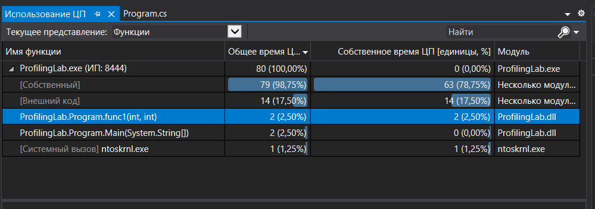
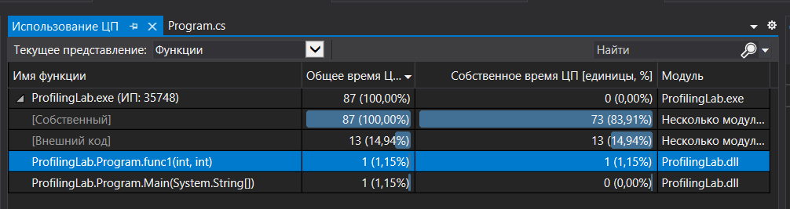

# Profiling
## Source Code
```
static int func1(int a, int b)
		{
			for (int i = 0; i < 10; i++)
			{
				int res = func2(a, b);
				if (res > 0)
					return res;
			}

			return 0;
		}

		static int func2(int a, int b)
		{
			int res = 0;
		
			for (int i = 0; i < 10; i++)
			{
				Thread.Sleep(1);
				if (i > 8)
					res = resultOfSum(a, b);
				if (res > 0)
					return res;
			}
			return res;
		}
		static int resultOfSum(int a, int b)
		{
			return a + b;
		}

		static void Main(string[] args)
        {
			func1(5, 10);

        }
```
## Profiling Results
- Before optimization

- After Optimization
 Total time decreased
